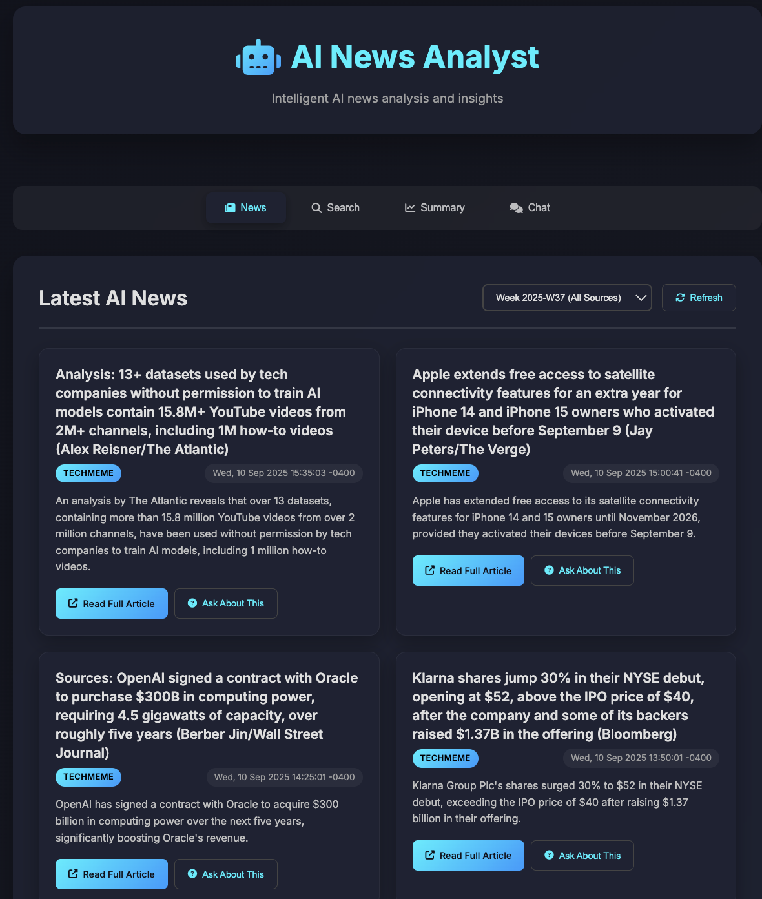
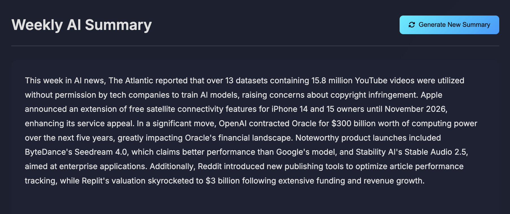
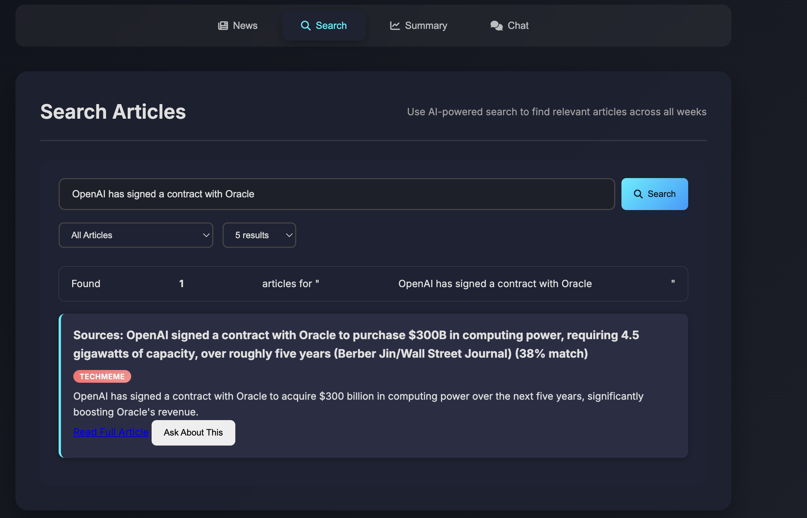
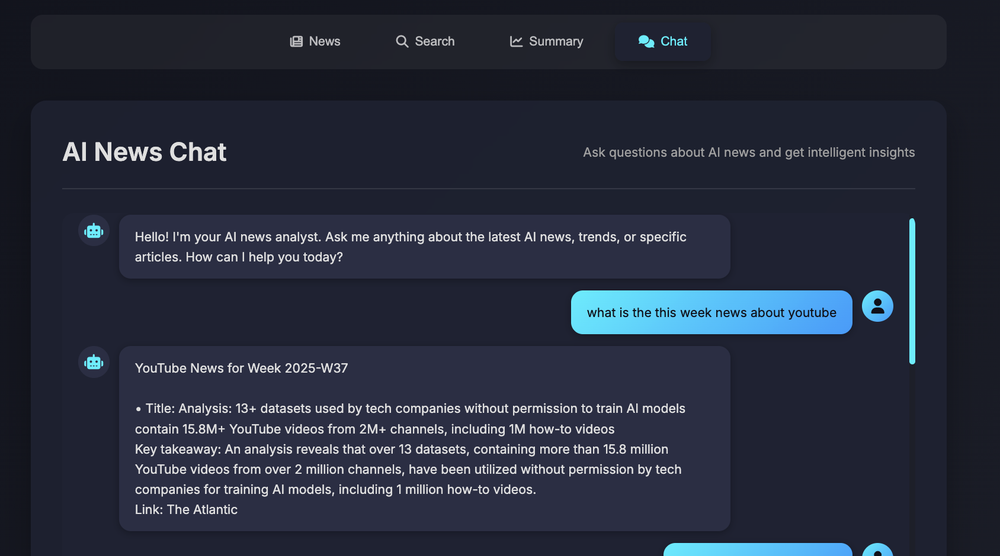

 **Summery**  
Cut through the AI news noise—**AI News Analyst** is an intelligent news platform designed to help busy professionals, researchers and students stay on top of AI trends.  
Get concise weekly summaries, and deep article insights by RAG(retrieval-augmented generation).

> **Why use AI News Analyst?**  
> - Save hours on manual research  
> - Catch up quickly on fast-moving topics  
> - Always have context: chat bot ask anything about the news

---

## Table of Contents
- [AI News Analyst](#ai-news-analyst)
  - [Table of Contents](#table-of-contents)
  - [Features](#features)
    - [What sets this apart?](#what-sets-this-apart)
  - [Project Structure](#project-structure)
  - [Usage](#usage)
    - [News](#news)
    - [Weekly Summary](#weekly-summary)
    - [Search](#search)
    - [Chat](#chat)
    - [Managing News Sources](#managing-news-sources)
  - [Retrieval-Augmented Generation (RAG)](#retrieval-augmented-generation-rag)
  - [API](#api)
  - [Technologies](#technologies)
  - [Data Sources](#data-sources)
  - [Development \& Future Plans](#development--future-plans)

---

## Features

- **Curated News Dashboard:** Browse up-to-date AI news with concise, AI-generated summaries and direct source links  
- **Weekly Summary Reports:** Let the AI generate a week-in-review—a quick, smart overview of the biggest stories  
- **AI Chat Assistant:** Ask questions about articles, themes, companies, or overall trends for instant context  
- **RAG Similarity Search:** Find related news using a cutting-edge retrieval-augmented pipeline—explore clusters, discover patterns  
- **Modern UX:** Responsive web design with intuitive navigation (mobile-friendly)  

### What sets this apart?
- Integrated Q&A over *all* stored news—no other aggregator explains context this deeply  
- State-of-the-art vector similarity search for discovery  
- Fully open, extensible—easy to add more sources or improve the underlying models

---

## Project Structure

```plaintext
ai_news/
├── agents/                # Core AI modules (chatbot, doc loader, summary reporter)
├── data/                  # News datasets (JSON)
├── rag/                   # RAG pipeline logic
├── static/                # CSS/JS assets
├── templates/             # HTML templates
├── app.py                 # Flask app
└── requirements.txt       # Python dependencies
```


## Usage

### News
- Browse recent AI news
- Read concise summaries or jump to full sources
- Use **"Ask About This"** to get AI-powered analysis of any article



### Weekly Summary
- Click **"Generate New Summary"** to receive a weekly report




### Search
- Enter a query to find related news using RAG
- Results are de-duplicated and ranked by relevance



### Chat
- Ask questions about articles, trends, or companies
- Use quick-prompt chips for inspiration
- Conversations persist during your session



### Managing News Sources
The project includes a unified news loader to manage multiple sources:

```bash
# Fetch from all sources
python3 agents/doc_loader/unified_news_loader.py fetch

# Process specific week for all sources
python3 agents/doc_loader/unified_news_loader.py process 2025-W37

# Create combined weekly file
python3 agents/doc_loader/unified_news_loader.py combined 2025-W37

# List available weeks
python3 agents/doc_loader/unified_news_loader.py list
```

---

## Retrieval-Augmented Generation (RAG)

**How it works:**
- Embeds all articles using `sentence-transformers/all-mpnet-base-v2` (selected for high semantic similarity accuracy)
- Stores embeddings in a **Chroma** vector database (optimized for fast retrieval and scale)
- At query time, retrieves relevant articles via similarity search—feeds results to the LLM for context-rich responses

**Pipeline:**
1. **Load Articles:** Parse `data/` JSON files
2. **Embed & Store:** Generate HuggingFace embeddings → Chroma DB
3. **Query:** RAG similarity search with scoring
4. **Deduplicate:** Remove duplicates by URL
5. **Respond:** LLM answers using only verified news context

---

## API

| Endpoint              | Method | Description                 |
|-----------------------|--------|-----------------------------|
| `/news`               | GET    | Fetch latest news           |
| `/summary`            | POST   | Generate weekly summary     |
| `/chat`               | POST   | Interactive news Q&A        |
| `/search?q=query`     | GET    | RAG similarity search       |

---

## Technologies

- **Backend:** Flask (Python)
- **AI/ML:** LangChain, OpenAI GPT APIs, HuggingFace transformers
- **Frontend:** HTML5, CSS3, JavaScript (ES6+)
- **Database:** Chroma for vector embeddings
- **Data:** JSON news dump (MIT AI News, extensible)

---

## Data Sources

- **MIT AI News** - Curated AI research and news from MIT (`data/mit_ai_news.json`)
- **Techmeme** - Top technology news and commentary from around the web (`data/techmeme_news.json`)
- **Combined Sources** - Weekly aggregated data from all sources (`data/combined-week-*.json`)

*Easy to extend to more sources—add a loader under `agents/doc_loader` and plug into the RAG pipeline.*

---

## Development & Future Plans

**Planned:**
- Ingest more sources (e.g., TechCrunch, Arxiv, CB Insights)
- Deploy a scalable demo (hosting TBA; currently local/prototype due to OpenAI API and vector DB costs)
- Personalized feeds and user accounts

**Recently Added:**
- **Techmeme Integration** - Added support for Techmeme RSS feed as a news source
- **Unified News Loader** - Created `unified_news_loader.py` to manage multiple news sources
- **Combined Weekly Data** - Generate weekly files that aggregate articles from all sources
- **Source Attribution** - Display source information for each article in the UI

**Issues/Help Wanted:**
- Support new news formats
- UI/UX improvements
- Docker deployment script

---
# News-analyzer
